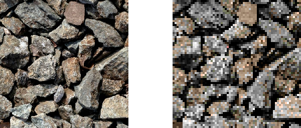
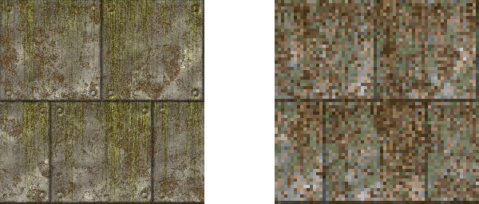
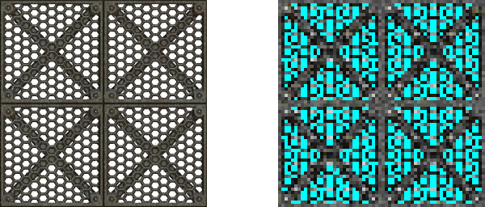

# doomify
Doomify is a utility written in python that was initially intended for creating custom DOOM textures. This is done by taking a source image and generating a copy of it with its color detail restricted to only include colors found within a given palette by the user, choosing the closest available color in the palette for each pixel when necessary. When this is done with the original DOOM palette to a photorealtic texture for example, the image that is returned can look very similar to the textures seen in the original game, potentially making it a helpful tool for automating the texture creation process for WAD makers. As any set of colors can be used when generating an image, whether it be from another game or a custom made one, it also acts as an easy way for digitizing sprites, and other general creative work where intentionally restricting color may be needed.

<h2>Examples </h2>


[https://freestocktextures.com/texture/stone-pebble-ground,209.html](https://freestocktextures.com/texture/stone-pebble-ground,209.html)


[https://www.flickr.com/photos/filterforge/8957965094](https://www.flickr.com/photos/filterforge/8957965094)


[https://www.flickr.com/photos/filterforge/8692229250](https://www.flickr.com/photos/filterforge/8692229250)

<h1>palletes.py and Adding Palettes</h1>
Color sets used by the program are found in <b>palletes.py</b>. When adding new palettes, they should be represented in this file as an array of tuples containing the RGB values (0-255) of each color:

```
EXAMPLE_PALETTE = {
    (128,0,128), #color 1
    (0,255,255), #color 2
    ... }
```

Once a palette has been declared, it must be added to the <b>PALETTES</b> dictionary in <b>doomify.py</b> in order to be selectable in the main program. The key is what must be entered by the user when the program is run to select the palette, while the value should be another tuple that contains a displayed name for the palette, as well as the actual array of colors:

```
"4":("My own palette",EXAMPLE_PALETTE)
```

The following color palettes are already available:

- DOOM
- QUAKE

<h1>Prerequisites</h1>

- Python 3
- Pillow is also required in order to process images:

```
pip install Pillow
```