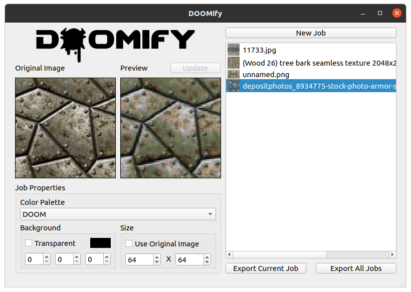

DOOMify is a color quantization tool used for quickly generating retro game textures and sprites. When given a source image, an output image can be exported with its color detail restricted to those found in the given palette, whether it be built-in, or through another image's colors provided by the user.


# Requirements
DOOMify is built with the Qt toolkit, and relies on the <u>**Core, Widgets** and **GUI**</u> Libraries in order to function. It is also reccomended that you have Qt Creator and Designer, even if you will not be working with the DOOMify UI directly.

**<u>Ensure you that you are using a version of Qt 5!</u>**
## Windows
Use the [Qt Online Installer](https://www.qt.io/download-qt-installer) to install the components described above. **It is also recommended that you install and use the <u>MinGW Toolchain</u>** over MSVC if you will be building for desktop, although the latter should still work.

## Linux 
```
sudo apt-get install qt5-default
sudo apt install qtcreator
```

# License and Attributions
DOOMify is subject to the same terms found within the [Qt Open Source License](https://www.qt.io/licensing/open-source-lgpl-obligations). Like the modules used, DOOMify is also provided under the GNU General Public License (see **LICENSE**).

DOOMify uses a copy of the 'single include' version of [JSON for Modern C++](https://github.com/nlohmann/json) (Ver. 3.11.2), which is made available under the [MIT License](./src/json/nlohmann/LICENSE.MIT). Copyright © 2013-2022 [Niels Lohmann](https://nlohmann.me/).